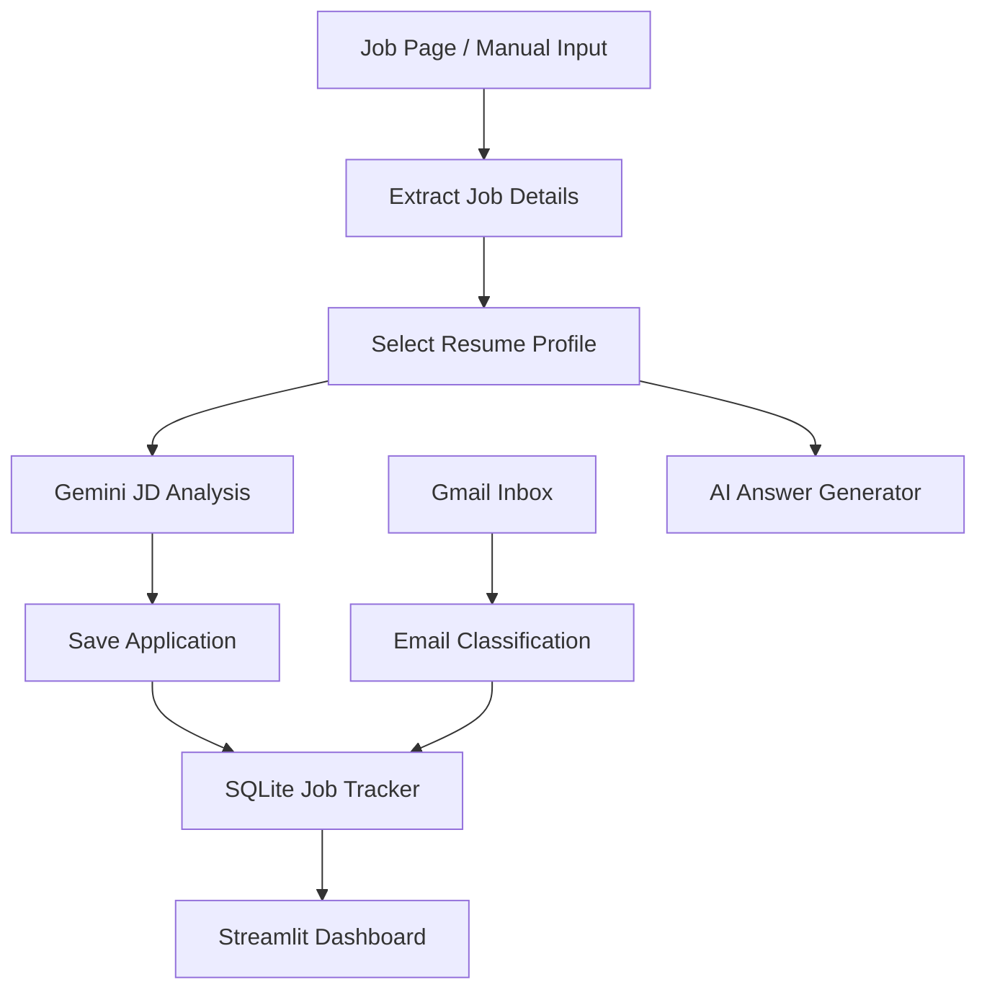
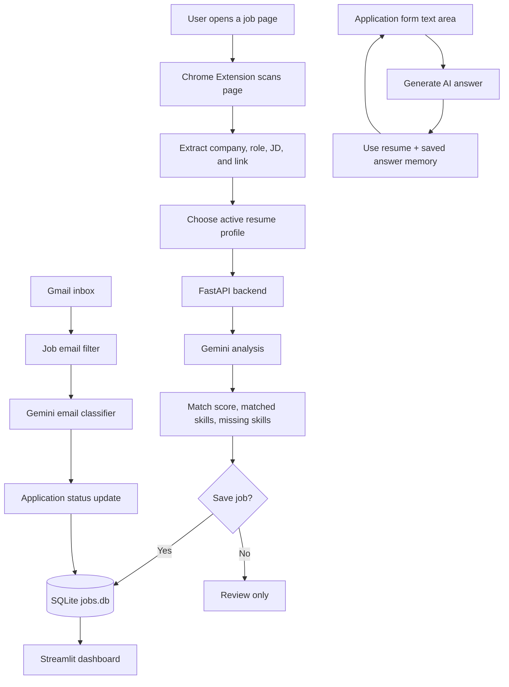
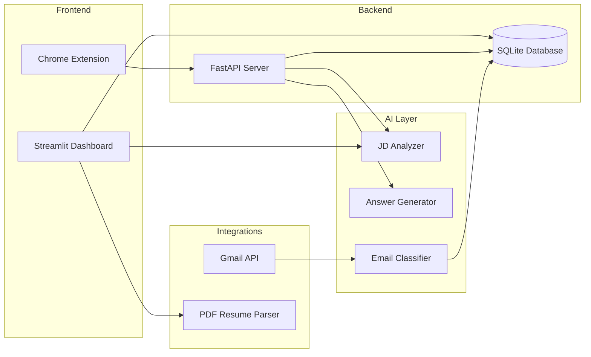

# 🚀 Talent Pilot

**AI-powered job application tracker, resume matcher, Gmail sync assistant, and Chrome job copilot** 🧠💼

Talent Pilot is a local-first job search automation system that helps you track applications, analyze job descriptions against resume profiles, draft application answers, and sync recruiting emails into one dashboard.

---

## 🎬 Demo Video

[](https://youtu.be/dZEQe_gm0mY)

*Watch Talent Pilot in action: job detection, resume matching, AI answer generation, and dashboard tracking* 🎥

---

## 📋 Table of Contents

- [🎯 Project Goal](#-project-goal)
- [🤖 What Talent Pilot Does](#-what-talent-pilot-does)
- [🔄 End-to-End Flow Diagram](#-end-to-end-flow-diagram)
- [⚡ Core Workflows](#-core-workflows)
- [🧩 Real-World Use Cases](#-real-world-use-cases)
- [🧠 Why This Matters](#-why-this-matters)
- [🏗️ Architecture](#️-architecture)
- [🔧 Features](#-features)
- [📁 Project Structure](#-project-structure)
- [🚀 How to Run](#-how-to-run)
- [🧩 Chrome Extension Setup](#-chrome-extension-setup)
- [📡 API Endpoints](#-api-endpoints)
- [🔐 Privacy and GitHub Safety](#-privacy-and-github-safety)
- [📝 Notes](#-notes)

---

## 🎯 Project Goal

This project targets a practical job-search problem:

> **Reducing manual effort while applying, tracking, and following up on job applications** ⏱️

Job hunting usually involves repetitive work:

- 📌 Saving job details from multiple websites
- 📄 Matching job descriptions against different resume versions
- ✍️ Writing similar application answers again and again
- 📬 Checking emails for application updates
- 📊 Remembering which company is at which stage

**Talent Pilot automates:**

- 🔍 Job page detection
- 🧠 Resume/job-description analysis
- 💬 AI answer generation
- 📥 Gmail recruiting email classification
- 📊 Local job application tracking

The focus is on **personal productivity for real job applications**, not a generic demo chatbot. 🎯

---

## 🤖 What Talent Pilot Does

Talent Pilot works like an AI copilot for your job search.

It follows:

**Detect → Analyze → Save → Track → Sync → Assist** 🔄

### Pipeline



Unlike a normal spreadsheet tracker, Talent Pilot can also reason over job descriptions, use resume context, and update application status from email signals.

---

## 🔄 End-to-End Flow Diagram



This flow shows how Talent Pilot connects browser context, resume profiles, AI analysis, local tracking, answer generation, and Gmail updates into one job-search loop.

---

## ⚡ Core Workflows

### 1. Job Tracking Dashboard 📊

- Add job applications manually
- Store company, role, job description, status, source, resume used, and notes
- Filter applications by company, role, and status
- Export selected applications as CSV

### 2. Resume Match Analysis 🧠

- Select a resume profile JSON
- Analyze a job description using Gemini
- Return match percentage, matched skills, missing skills, and recruiter-style summary

### 3. PDF Resume Onboarding 📄

- Upload a PDF resume from the Streamlit sidebar
- Extract text from the PDF
- Convert resume content into structured JSON using Gemini
- Save it as a reusable profile in `data/`

### 4. Gmail Sync 📬

- Connect to Gmail using OAuth
- Fetch recent job-related emails
- Filter likely recruiting emails before sending to AI
- Classify email status with Gemini
- Update matching job records in the local database

### 5. Chrome Extension Copilot 🧩

- Detect job pages on LinkedIn, Greenhouse, Lever, Wellfound, and generic job sites
- Analyze role fit from the browser popup
- Save jobs directly to the local dashboard
- Generate AI answers for text fields on application pages

---

## 🧩 Real-World Use Cases

### 1. Applying from LinkedIn 💼

- Open a job page
- Click the extension
- Detect company, role, and JD
- Analyze resume match
- Save the job to the dashboard

### 2. Comparing Resume Profiles 🎯

- Maintain separate resume profiles, such as AI Engineer or SRE
- Select the active profile
- Run JD analysis against the selected target track

### 3. Drafting Application Answers ✍️

- Detect long-answer fields on application forms
- Generate concise, role-aware answers
- Reuse memory snippets from previous saved answers

### 4. Tracking Email Updates 📬

- Sync Gmail
- Detect application confirmations, assessments, interviews, offers, and rejections
- Update the local database automatically

---

## 🧠 Why This Matters

Most job-search workflows are scattered:

- Job details live in browser tabs 🌐
- Resume versions live in folders 📁
- Application status lives in memory 🧠
- Email updates live in Gmail 📬
- Notes live somewhere else entirely 📝

Talent Pilot brings these into one local system:

- One dashboard for tracking 📊
- One database for application state 🗃️
- One AI layer for JD matching and answers 🤖
- One browser extension for job-page context 🧩

---

## 🏗️ Architecture



---

## 🔧 Features

- 🚀 Streamlit dashboard for local job tracking
- ⚡ FastAPI backend for extension-to-app communication
- 🧠 Gemini-powered job-description analysis
- ✍️ Gemini-powered application answer generation
- 📄 PDF-to-JSON resume profile creation
- 🎯 Multiple resume profiles for different job tracks
- 📬 Gmail sync with recruiter email classification
- 🧩 Chrome extension for live job-page detection
- 💾 Local SQLite storage
- 🔐 Git-safe setup with ignored secrets, tokens, resumes, logs, and databases

---

## 📁 Project Structure

```text
.
├── app.py                    # Streamlit dashboard 🚀
├── db.py                     # SQLite database helpers 🗃️
├── config.py                 # Status constants and logging setup ⚙️
├── utils.py                  # Resume/profile and sync timestamp helpers 🧰
├── sync_controller.py        # Gmail sync orchestration 📬
├── requirements.txt          # Python dependencies 📦
├── api/
│   └── server.py             # FastAPI server used by the Chrome extension 🌐
├── ai/
│   ├── resume_parser.py      # JD analysis, answer generation, PDF resume parsing 🧠
│   └── email_classifier.py   # Gmail email classification 🤖
├── integrations/
│   └── gmail_client.py       # Gmail OAuth and email fetch logic 📥
├── extension/
│   ├── manifest.json         # Chrome extension manifest 🧩
│   ├── popup.html            # Extension popup UI 🪟
│   ├── popup.js              # Popup logic and API calls 🔌
│   ├── content.js            # Job-page extraction and answer buttons 🔍
│   └── rules.example.js      # Safe autofill template 📝
├── data/
│   └── .gitkeep              # Private resume data lives here locally 🔒
└── logs/
    └── .gitkeep              # Local logs live here 🔒
```

---

## 🚀 How to Run

### Prerequisites

- Python 3.10+ 🐍
- pip 📦
- Google Gemini API key 🔑
- Google Cloud OAuth credentials for Gmail sync, if using Gmail 📬

### Installation

Create and activate a virtual environment:

```bash
python -m venv .venv
.venv\Scripts\activate
```

Install dependencies:

```bash
pip install -r requirements.txt
```

Create your local environment file:

```bash
copy .env.example .env
```

Add your Gemini API key inside `.env`:

```env
GEMINI_API_KEY=your_gemini_api_key_here
```

### Start Streamlit Dashboard

```bash
streamlit run app.py
```

Dashboard:

- **UI**: http://localhost:8501 🌐

### Start FastAPI Backend

```bash
uvicorn api.server:app --reload --port 8000
```

Backend:

- **API**: http://localhost:8000 🌐
- **Docs**: http://localhost:8000/docs 📖

### Run Gmail Sync Directly

```bash
python sync_controller.py
```

---

## 🧩 Chrome Extension Setup

Before loading the extension, create your private local rules file:

```bash
copy extension\rules.example.js extension\rules.js
```

Edit `extension/rules.js` with your own safe autofill defaults.

Then load it in Chrome:

1. Open `chrome://extensions`
2. Enable **Developer mode**
3. Click **Load unpacked**
4. Select the `extension/` folder
5. Keep FastAPI running at `http://localhost:8000`

---

## 📡 API Endpoints

### GET `/profiles`

Returns available resume profile JSON files from `data/`.

### POST `/check-job`

Checks whether a company and role already exist in the database.

Example:

```json
{
  "company": "Example Corp",
  "role": "AI Engineer"
}
```

### POST `/analyze-job`

Analyzes a job description against the selected resume profile.

Example:

```json
{
  "company": "Example Corp",
  "role": "AI Engineer",
  "jd_text": "We are looking for Python, FastAPI, and ML experience...",
  "link": "https://example.com/job",
  "profile": "resume_ai.json"
}
```

### POST `/save-job`

Saves a detected job into the local SQLite database.

### POST `/generate-answer`

Generates a concise application answer using the question, role, company, JD, and active resume profile.

### POST `/save-answer`

Stores a strong answer in the local memory bank under `data/answers/`.

---

## 🔐 Privacy and GitHub Safety

This project is designed to stay local-first.

The following files are intentionally ignored and should not be committed:

- `.env`
- `credentials.json`
- `token.json`
- `jobs.db`
- `data/*.json`
- `data/answers/`
- `logs/`
- `extension/rules.js`
- `__pycache__/`

Safe templates are provided:

- `.env.example`
- `extension/rules.example.js`

---

## 📝 Notes

- The app creates `jobs.db` automatically when the dashboard starts.
- Gmail sync requires Google OAuth credentials saved as `credentials.json`.
- `token.json` is generated after the first Gmail authorization.
- Resume profiles and generated answer memory are stored locally in `data/`.
- The Chrome extension expects the FastAPI server to run on port `8000`.

---

## 🎯 Key Takeaway

Talent Pilot is not just a tracker. It is a local AI job-search copilot that:

- Detects job context from browser pages 🔍
- Reasons over job descriptions and resume profiles 🧠
- Drafts application answers ✍️
- Tracks job status in a local dashboard 📊
- Syncs recruiting email updates from Gmail 📬

---

*Made with ❤️ by [Aniruddh Parashar](https://github.com/AniP-C)*
