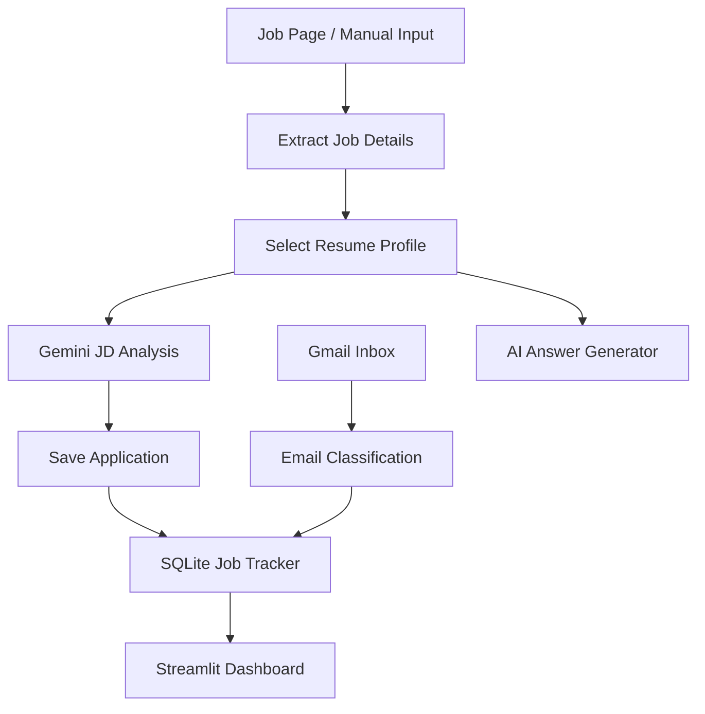
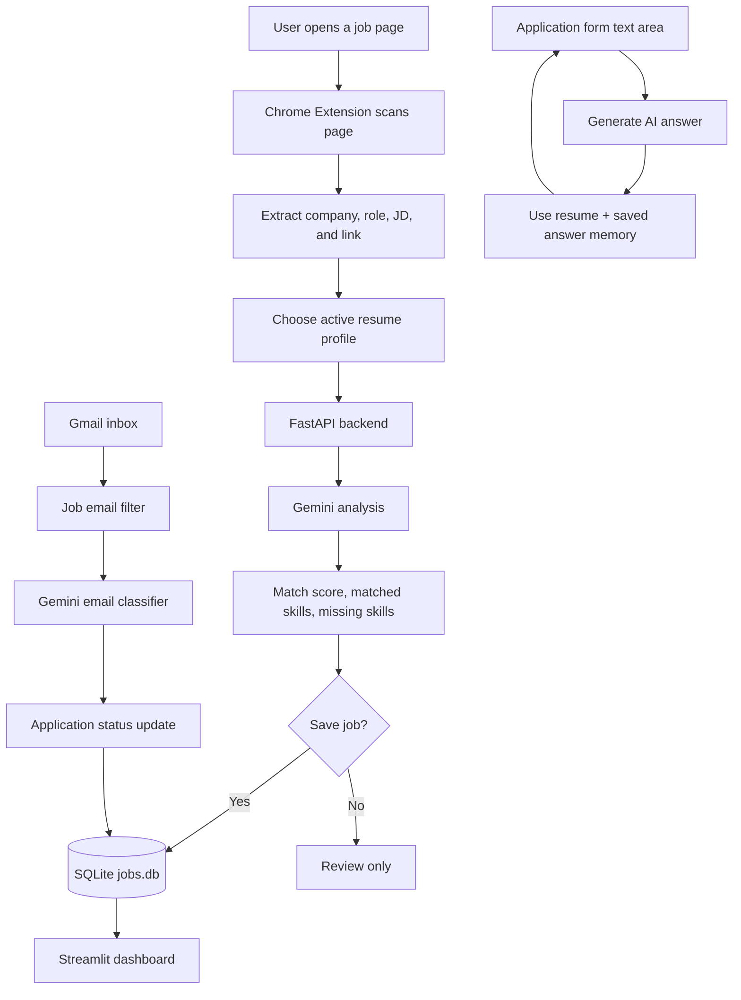
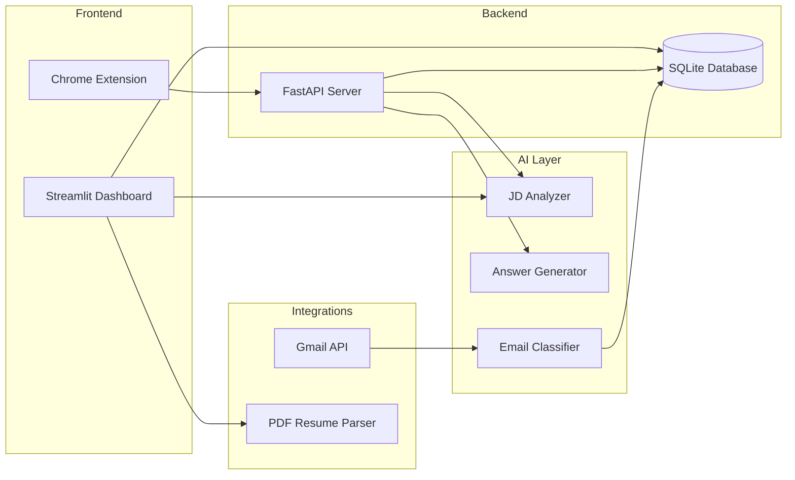

# 🚀 Talent Pilot

**AI-powered job application tracker, resume matcher, Gmail sync assistant, and Chrome job copilot** 🧠💼

Talent Pilot is a local-first job search automation system that helps you track applications, analyze job descriptions against resume profiles, draft application answers, and sync recruiting emails into one dashboard.

---

## 🎬 Demo Video

[](https://youtu.be/dZEQe_gm0mY)

*Watch Talent Pilot in action: job detection, resume matching, AI answer generation, and dashboard tracking* 🎥

---

## 📋 Table of Contents

- [🎯 Project Goal](#-project-goal)
- [🤖 What Talent Pilot Does](#-what-talent-pilot-does)
- [🔄 End-to-End Flow Diagram](#-end-to-end-flow-diagram)
- [⚡ Core Workflows](#-core-workflows)
- [🧩 Real-World Use Cases](#-real-world-use-cases)
- [🧠 Why This Matters](#-why-this-matters)
- [🏗️ Architecture](#️-architecture)
- [🔧 Features](#-features)
- [🔑 Accounts and Data Isolation](#-accounts-and-data-isolation)
- [📁 Project Structure](#-project-structure)
- [🚀 How to Run](#-how-to-run)
- [🧩 Chrome Extension Setup](#-chrome-extension-setup)
- [📡 API Endpoints](#-api-endpoints)
- [☁️ Deploying](#️-deploying)
- [🩺 Logging and Troubleshooting](#-logging-and-troubleshooting)
- [🧪 Testing](#-testing)
- [🔐 Privacy and GitHub Safety](#-privacy-and-github-safety)
- [📝 Notes](#-notes)

---

## 🎯 Project Goal

This project targets a practical job-search problem:

> **Reducing manual effort while applying, tracking, and following up on job applications** ⏱️

Job hunting usually involves repetitive work:

- 📌 Saving job details from multiple websites
- 📄 Matching job descriptions against different resume versions
- ✍️ Writing similar application answers again and again
- 📬 Checking emails for application updates
- 📊 Remembering which company is at which stage

**Talent Pilot automates:**

- 🔍 Job page detection
- 🧠 Resume/job-description analysis
- 💬 AI answer generation
- 📥 Gmail recruiting email classification
- 📊 Local job application tracking

The focus is on **personal productivity for real job applications**, not a generic demo chatbot. 🎯

---

## 🤖 What Talent Pilot Does

Talent Pilot works like an AI copilot for your job search.

It follows:

**Detect → Analyze → Save → Track → Sync → Assist** 🔄

### Pipeline


```mermaid
graph TD
    A[Job Page / Manual Input] --> B[Extract Job Details]
    B --> C[Select Resume Profile]
    C --> D[Gemini JD Analysis]
    D --> E[Save Application]
    E --> F[SQLite Job Tracker]
    G[Gmail Inbox] --> H[Email Classification]
    H --> F
    F --> I[Streamlit Dashboard]
    C --> J[AI Answer Generator]
```

Unlike a normal spreadsheet tracker, Talent Pilot can also reason over job descriptions, use resume context, and update application status from email signals.

---

## 🔄 End-to-End Flow Diagram


```mermaid
flowchart TD
    U[User opens a job page] --> EXT[Chrome Extension scans page]
    EXT --> EXTRACT[Extract company, role, JD, and link]
    EXTRACT --> PROFILE[Choose active resume profile]
    PROFILE --> API[FastAPI backend]
    API --> GEMINI[Gemini analysis]
    GEMINI --> SCORE[Match score, matched skills, missing skills]
    SCORE --> SAVE{Save job?}
    SAVE -->|Yes| DB[(SQLite jobs.db)]
    SAVE -->|No| REVIEW[Review only]
    DB --> DASH[Streamlit dashboard]

    FORM[Application form text area] --> ANSWER[Generate AI answer]
    ANSWER --> MEMORY[Use resume + saved answer memory]
    MEMORY --> FORM

    GMAIL[Gmail inbox] --> FILTER[Job email filter]
    FILTER --> CLASSIFY[Gemini email classifier]
    CLASSIFY --> STATUS[Application status update]
    STATUS --> DB
```

This flow shows how Talent Pilot connects browser context, resume profiles, AI analysis, local tracking, answer generation, and Gmail updates into one job-search loop.

---

## ⚡ Core Workflows

### 1. Job Tracking Dashboard 📊

- Add job applications manually
- Store company, role, job description, status, source, resume used, and notes
- Filter applications by company, role, and status
- Export selected applications as CSV

### 2. Resume Match Analysis 🧠

- Select a resume profile JSON
- Analyze a job description using Gemini
- Return match percentage, matched skills, missing skills, and recruiter-style summary

### 3. PDF Resume Onboarding 📄

- Upload a PDF resume from the Streamlit sidebar
- Extract text from the PDF
- Convert resume content into structured JSON using Gemini
- Save it as a reusable profile in `data/`

### 4. Gmail Sync 📬

- Connect to Gmail using OAuth
- Fetch recent job-related emails
- Filter likely recruiting emails before sending to AI
- Classify email status with Gemini
- Update matching job records in the local database

### 5. Chrome Extension Copilot 🧩

- Detect job pages on LinkedIn, Greenhouse, Lever, Wellfound, and generic job sites
- Analyze role fit from the browser popup
- Save jobs directly to the local dashboard
- Generate AI answers for text fields on application pages

---

## 🧩 Real-World Use Cases

### 1. Applying from LinkedIn 💼

- Open a job page
- Click the extension
- Detect company, role, and JD
- Analyze resume match
- Save the job to the dashboard

### 2. Comparing Resume Profiles 🎯

- Maintain separate resume profiles, such as AI Engineer or SRE
- Select the active profile
- Run JD analysis against the selected target track

### 3. Drafting Application Answers ✍️

- Detect long-answer fields on application forms
- Generate concise, role-aware answers
- Reuse memory snippets from previous saved answers

### 4. Tracking Email Updates 📬

- Sync Gmail
- Detect application confirmations, assessments, interviews, offers, and rejections
- Update the local database automatically

---

## 🧠 Why This Matters

Most job-search workflows are scattered:

- Job details live in browser tabs 🌐
- Resume versions live in folders 📁
- Application status lives in memory 🧠
- Email updates live in Gmail 📬
- Notes live somewhere else entirely 📝

Talent Pilot brings these into one local system:

- One dashboard for tracking 📊
- One database for application state 🗃️
- One AI layer for JD matching and answers 🤖
- One browser extension for job-page context 🧩

---

## 🏗️ Architecture


```mermaid
graph LR
    subgraph "Frontend"
        S[Streamlit Dashboard]
        X[Chrome Extension]
    end

    subgraph "Backend"
        API[FastAPI Server]
        DB[(SQLite Database)]
    end

    subgraph "AI Layer"
        JD[JD Analyzer]
        ANS[Answer Generator]
        EMAIL[Email Classifier]
    end

    subgraph "Integrations"
        G[Gmail API]
        P[PDF Resume Parser]
    end

    S --> DB
    S --> JD
    S --> P
    X --> API
    API --> JD
    API --> ANS
    API --> DB
    G --> EMAIL
    EMAIL --> DB
```

---

## 🔧 Features

- 🔑 Account registration and sign-in with hashed passwords
- 🚀 Streamlit dashboard for local job tracking
- ⚡ FastAPI backend for extension-to-app communication
- 🧠 Gemini-powered job-description analysis
- ✍️ Gemini-powered application answer generation
- 📄 PDF-to-JSON resume profile creation
- 🎯 Multiple resume profiles for different job tracks
- 📬 Gmail sync with recruiter email classification
- 🧩 Chrome extension for live job-page detection
- 💾 Local SQLite storage, isolated per account
- 🧪 Test suite covering auth, storage, path safety, and API contracts
- 🔐 Git-safe setup with ignored secrets, tokens, resumes, logs, and databases

---

## 🔑 Accounts and Data Isolation

Every user registers with an email and password. Passwords are stored as
PBKDF2-HMAC-SHA256 digests (600,000 iterations, per-user random salt) — never
in plaintext.

Each account gets its own workspace directory, keyed by numeric account id:

```text
data/
├── users.db                      # accounts and API tokens (central)
└── workspaces/
    └── 1/
        ├── jobs.db               # that user's applications
        ├── profiles/*.json       # that user's resume profiles
        ├── answers/*.txt         # that user's saved answers
        ├── gmail_token.json      # that user's Gmail authorization
        └── last_sync.txt
```

Because paths are derived from the account id rather than from anything a
caller sends, one account's data is structurally unreachable from another
account's session.

**The browser extension signs in with the same credentials.** It receives a
bearer token, stored in the extension's service worker, and sends it with
every request. The API takes identity from that token only — no request field
names the account — so a caller cannot act on someone else's workspace.

---

## 📁 Project Structure

```text
.
├── app.py                    # Streamlit dashboard 🚀
├── ui.py                     # Dashboard styling and render helpers 🎨
├── auth.py                   # Registration, sign-in, password hashing, tokens 🔑
├── workspace.py              # Per-user paths and path-traversal defences 📂
├── db.py                     # SQLite job storage 🗃️
├── config.py                 # Paths, status SSOT, settings, logging ⚙️
├── utils.py                  # Profile loading and sync timestamps 🧰
├── sync_controller.py        # Gmail sync orchestration 📬
├── requirements.txt          # Runtime dependencies 📦
├── requirements-dev.txt      # Test dependencies 🧪
├── api/
│   └── server.py             # Token-authenticated FastAPI server 🌐
├── ai/
│   ├── gemini.py             # Shared Gemini client and error mapping 🔌
│   ├── resume_parser.py      # JD analysis, answer generation, PDF parsing 🧠
│   └── email_classifier.py   # Recruiter email classification 🤖
├── integrations/
│   └── gmail_client.py       # Gmail OAuth and email fetch logic 📥
├── extension/
│   ├── manifest.json         # Chrome extension manifest 🧩
│   ├── background.js         # Service worker: owns the token and all API calls 🔐
│   ├── popup.html            # Extension popup UI 🪟
│   ├── popup.js              # Popup logic 🔌
│   ├── content.js            # Job-page extraction and answer buttons 🔍
│   └── rules.example.js      # Safe autofill template 📝
├── tests/                    # pytest suite 🧪
├── data/
│   └── .gitkeep              # Accounts and per-user workspaces live here 🔒
└── logs/
    └── .gitkeep              # Local logs live here 🔒
```

---

## 🚀 How to Run

### Prerequisites

- Python 3.10+ 🐍
- pip 📦
- Google Gemini API key 🔑
- Google Cloud OAuth credentials for Gmail sync, if using Gmail 📬

### Installation

Create and activate a virtual environment:

```bash
python -m venv .venv
.venv\Scripts\activate
```

Install dependencies:

```bash
pip install -r requirements.txt
```

Create your local environment file:

```bash
copy .env.example .env
```

Add your Gemini API key inside `.env`:

```env
GEMINI_API_KEY=your_gemini_api_key_here
```

### ⚠️ Two servers, two ports

Talent Pilot runs **two separate processes**. Start each in its own terminal:

| Server | Port | Command | Used by |
| ------ | ---- | ------- | ------- |
| Streamlit dashboard | **8501** | `streamlit run app.py` | You, in the browser |
| FastAPI backend | **8000** | `uvicorn api.server:app --port 8000` | The Chrome extension |

Running the dashboard on port 8000 is the most common setup mistake — the
extension then talks to Streamlit instead of the API and cannot sign in. The
extension detects this and tells you, but the fix is always the same: give each
server its own port.

### Start the Dashboard

```bash
streamlit run app.py
```

- **UI**: http://localhost:8501 🌐

On first visit, open the **Create account** tab, register with an email and a
password of at least 8 characters, and you land straight in your workspace.

### Start the API Backend

```bash
uvicorn api.server:app --reload --port 8000
```

- **API**: http://localhost:8000 🌐
- **Docs**: http://localhost:8000/docs 📖
- **Health**: http://localhost:8000/health — should return
  `{"status":"ok","service":"talent-pilot-api",...}`. Anything else means a
  different app is on that port.

### Connect Gmail

Gmail is authorised per account from the dashboard sidebar (**Connect Gmail**),
which opens Google's consent screen and stores the token inside your own
workspace. Then use **Sync inbox now** to classify recent recruiter mail.

Requires `credentials.json` (a Google Cloud OAuth client secret) in the project
root.

---

## 🧩 Chrome Extension Setup

Before loading the extension, create your private local rules file:

```bash
copy extension\rules.example.js extension\rules.js
```

Edit `extension/rules.js` with your own safe autofill defaults.

Then load it in Chrome:

1. Open `chrome://extensions`
2. Enable **Developer mode**
3. Click **Load unpacked**
4. Select the `extension/` folder
5. Keep FastAPI running at `http://localhost:8000`
6. Open the extension popup and **sign in with your dashboard account**

The extension activates automatically on LinkedIn, Greenhouse, Lever,
Wellfound, Ashby, and Workable. On any other site, open the popup and click
**Enable Copilot on this site** to grant access to that origin only.

---

## 📡 API Endpoints

All endpoints except `/health` and the `/auth/*` entry points require a bearer
token:

```http
Authorization: Bearer <token>
```

Tokens come from `/auth/register` or `/auth/login` and are valid for 30 days.
**The account is always taken from the token**, never from the request body.

### Authentication

| Method | Endpoint | Purpose |
| ------ | -------- | ------- |
| `POST` | `/auth/register` | Create an account, returns a token |
| `POST` | `/auth/login` | Sign in, returns a token |
| `POST` | `/auth/logout` | Revoke the current token |
| `GET`  | `/auth/me` | Current account details |

```json
{ "email": "you@example.com", "password": "your-password" }
```

### Data

| Method | Endpoint | Purpose |
| ------ | -------- | ------- |
| `GET`  | `/profiles` | Your resume profiles |
| `GET`  | `/jobs` | Your tracked applications |
| `POST` | `/check-job` | Whether a company + role is already tracked |
| `POST` | `/save-job` | Save a detected job (409 if duplicate) |
| `PATCH`| `/jobs/{id}/status` | Update an application's status |
| `POST` | `/analyze-job` | Score a JD against your resume |
| `POST` | `/generate-answer` | Draft an application answer |
| `POST` | `/save-answer` | Store an answer in your memory bank |

Example `/analyze-job` body:

```json
{
  "company": "Example Corp",
  "role": "AI Engineer",
  "jd_text": "We are looking for Python, FastAPI, and ML experience...",
  "link": "https://example.com/job",
  "profile": "ai_engineer.json"
}
```

---

## ☁️ Deploying

For running this on a server, see **[DEPLOYMENT.md](DEPLOYMENT.md)** — it
covers Docker, Oracle Cloud Always Free, Hugging Face Spaces, the hosted Gmail
OAuth setup, TLS, backups, and a pre-flight checklist.

The short version:

```bash
docker compose up -d --build
```

Before exposing it publicly, set `SIGNUP_CODE` (otherwise anyone can register
and spend your Gemini quota), point `DATA_DIR` at persistent storage, and set
`PUBLIC_URL` so Gmail uses the redirect OAuth flow instead of the desktop one.

---

## 🩺 Logging and Troubleshooting

### Logs

| File | Contents |
| ---- | -------- |
| `logs/app.log` | Everything: every API request, auth events, sync progress (2 MB × 3 rotated) |
| `logs/errors.log` | Warnings and errors only, so problems are not buried (1 MB × 2 rotated) |

Every API request is logged with a short correlation id, the outcome, and how
long it took:

```text
01:16:34 | INFO    | [97e251c6] <-- POST /auth/register 201 (614ms)
01:16:35 | INFO    | [94bd7800] <-- POST /auth/login 200 (577ms)
```

That id is also returned in the `X-Request-ID` response header, so a failure in
the browser can be matched to the exact server-side line.

For per-call detail, set `LOG_LEVEL=DEBUG` in `.env`.

### Common problems

**The extension says the port is serving a different application.**
Streamlit is on port 8000 instead of the API. Run the dashboard on 8501 and
`uvicorn api.server:app --port 8000` for the API. Verify with
`curl http://localhost:8000/health`.

**The extension cannot reach the backend.**
The API is not running. Start it, then reopen the popup.

**Sign-in fails with correct credentials.**
Check `logs/app.log` for a `POST /auth/login` line. No line at all means the
request never reached the API — see the port problem above. A `401` line means
the credentials really were rejected.

**Your session expired.**
Tokens last 30 days, and changing your password revokes them. Sign in again
from the popup.

**Gmail sync does nothing.**
`credentials.json` must exist in the project root, and each account connects
Gmail separately from the dashboard sidebar.

---

## 🧪 Testing

```bash
pip install -r requirements-dev.txt
```

```bash
pytest
```

122 tests cover password hashing and token lifecycle, duplicate and status
handling in storage, workspace path-traversal defences, the email filter and
category mapping, and the API's authentication, CORS, and isolation
guarantees. No network calls — the Gemini and Gmail layers are not exercised.

---

## 🔐 Privacy and GitHub Safety

This project is designed to stay local-first.

The following files are intentionally ignored and should not be committed:

- `.env`
- `credentials.json`
- `token.json`
- `*.db`
- `data/` (accounts, workspaces, resumes, answers)
- `logs/`
- `extension/rules.js`
- `__pycache__/`

Safe templates are provided:

- `.env.example`
- `extension/rules.example.js`

### Security posture

- Passwords are PBKDF2-SHA256 hashed with a per-user salt; sign-in failures
  are constant-time so they cannot reveal whether an account exists.
- API tokens are stored as SHA-256 digests, so a leaked database does not hand
  out live sessions. Changing a password revokes every existing token.
- CORS accepts only `chrome-extension://` origins, so a web page you visit
  cannot call the localhost API.
- Caller-supplied filenames are rejected unless they are plain names inside
  the caller's own workspace.
- The extension's auth token lives in the service worker and is never exposed
  to page context. Scraped page values are rendered with `textContent`, so a
  hostile job posting cannot inject markup into the popup.

**Note:** the API listens on localhost over plain HTTP and is designed for
single-machine use. Put it behind TLS before exposing it to a network.

---

## 📝 Notes

- Workspaces and the account database are created automatically on first sign-in.
- Gmail sync requires Google OAuth credentials saved as `credentials.json`.
- Each account authorises Gmail separately; the token is stored in that user's workspace.
- The Chrome extension expects the FastAPI server to run on port `8000`.
- Duplicate detection is per company + role, independent of the application date.

---

## 🎯 Key Takeaway

Talent Pilot is not just a tracker. It is a local AI job-search copilot that:

- Detects job context from browser pages 🔍
- Reasons over job descriptions and resume profiles 🧠
- Drafts application answers ✍️
- Tracks job status in a local dashboard 📊
- Syncs recruiting email updates from Gmail 📬

---

*Made with ❤️ by [Aniruddh Parashar](https://github.com/AniP-C)*
