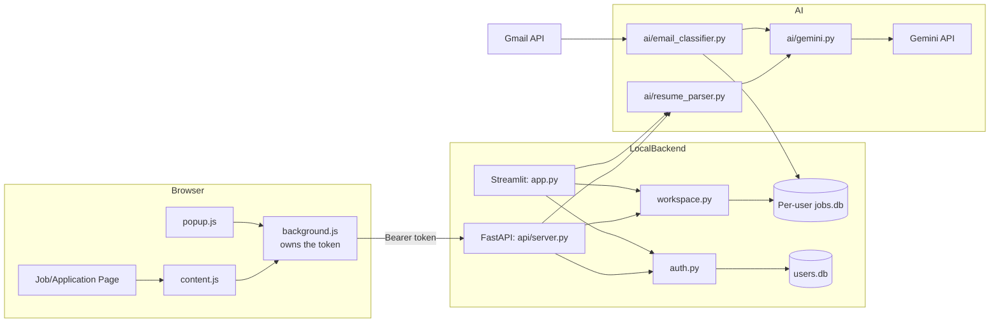
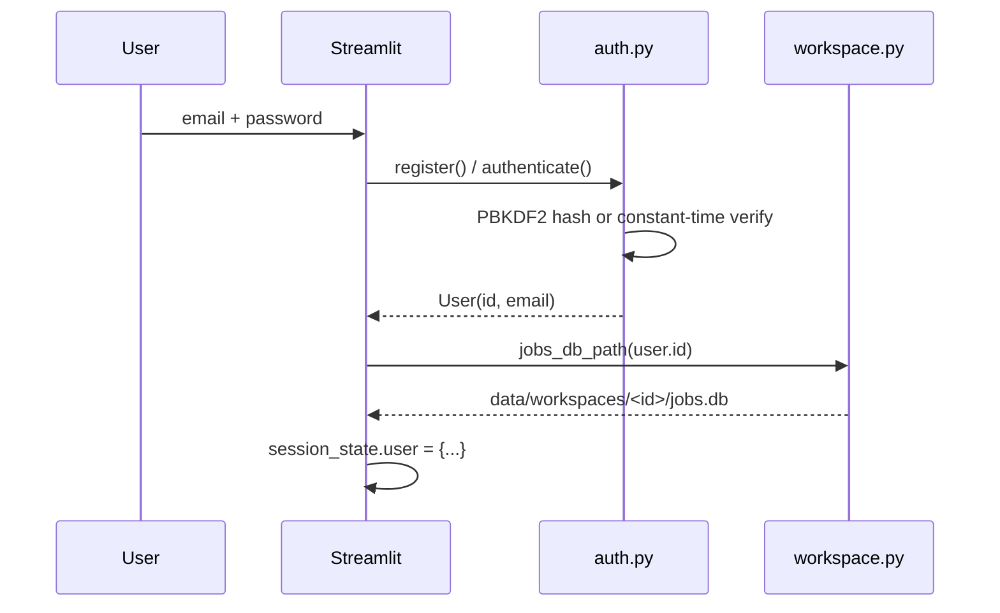
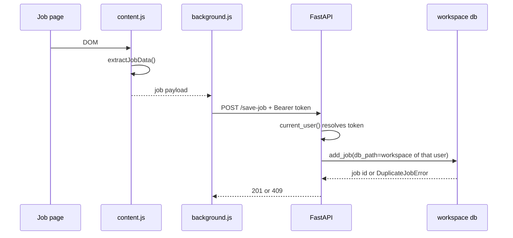
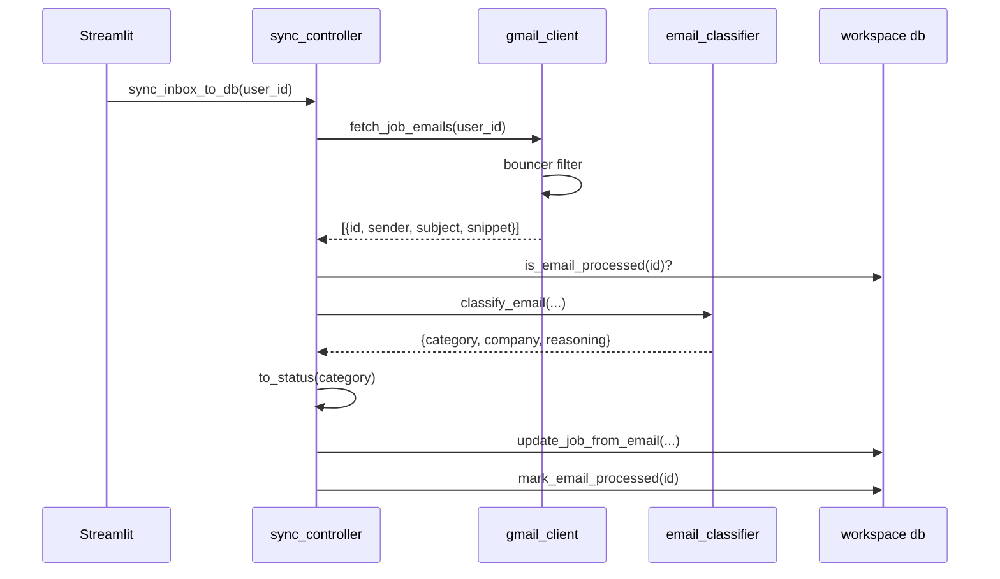

# Talent Pilot Technical Overview

This document explains the code structure, runtime flows, and implementation
details behind Talent Pilot. The README is the portfolio/GitHub overview; this
file is for developers who want to understand how the system is wired
internally.

## System Summary

Talent Pilot is a local-first job application assistant built from six parts:

1. **Accounts layer** — registration, sign-in, password hashing, API tokens.
2. **Streamlit dashboard** — manual tracking, resume onboarding, JD analysis.
3. **FastAPI backend** — token-authenticated API used by the Chrome extension.
4. **Gemini AI layer** — JD analysis, answer drafting, email classification, PDF parsing.
5. **Gmail integration** — per-user recruiting email sync.
6. **Chrome extension** — job-page extraction, match analysis, save actions, form assistance.

Job records, resume profiles, and answer memory are stored per account in
isolated workspace directories under `data/`. Nothing leaves the machine except
Gemini and Gmail API calls.

## High-Level Architecture



## Repository Structure

```text
.
|-- app.py                  Streamlit entrypoint
|-- ui.py                   Dashboard styling and render helpers
|-- auth.py                 Accounts, password hashing, API tokens
|-- workspace.py            Per-user paths and path-traversal defences
|-- db.py                   Job storage (per workspace)
|-- contacts.py             Recruiter contact selection (pure)
|-- posting.py              Salary and location normalisation (pure)
|-- config.py               Paths, status SSOT, settings, logging
|-- utils.py                Profile loading, sync timestamps
|-- sync_controller.py      Gmail sync orchestration
|-- requirements.txt
|-- requirements-dev.txt
|-- pytest.ini
|-- api/
|   `-- server.py           Token-authenticated FastAPI app
|-- ai/
|   |-- gemini.py           Shared client + structured-output helper
|   |-- resume_parser.py    JD analysis, answers, PDF parsing
|   `-- email_classifier.py Recruiter email classification
|-- integrations/
|   `-- gmail_client.py     Gmail OAuth and fetch, per user
|-- extension/
|   |-- manifest.json
|   |-- background.js       Service worker: token + all API calls
|   |-- popup.html
|   |-- popup.js
|   |-- content.js
|   `-- rules.example.js
|-- tests/
|   |-- conftest.py
|   |-- test_auth.py
|   |-- test_db.py
|   |-- test_workspace.py
|   |-- test_email_pipeline.py
|   `-- test_api.py
|-- data/                   Accounts + per-user workspaces (gitignored)
`-- logs/                   Rotating logs (gitignored)
```

## Identity Model

### Accounts

`auth.py` owns a single central database, `data/users.db`:

```sql
CREATE TABLE users (
    id            INTEGER PRIMARY KEY AUTOINCREMENT,
    email         TEXT NOT NULL UNIQUE COLLATE NOCASE,
    password_hash TEXT NOT NULL,
    created_at    TEXT NOT NULL,
    last_login_at TEXT
);

CREATE TABLE api_tokens (
    token_hash   TEXT PRIMARY KEY,
    user_id      INTEGER NOT NULL,
    created_at   TEXT NOT NULL,
    expires_at   TEXT NOT NULL,
    last_used_at TEXT,
    FOREIGN KEY (user_id) REFERENCES users(id) ON DELETE CASCADE
);

CREATE TABLE recovery_codes (
    code_hash  TEXT PRIMARY KEY,
    user_id    INTEGER NOT NULL,
    created_at TEXT NOT NULL,
    used_at    TEXT,
    FOREIGN KEY (user_id) REFERENCES users(id) ON DELETE CASCADE
);
```

Recovery codes stand in for the password-reset email this deployment cannot
send — the Gmail scope is `gmail.readonly`. Ten are issued at registration and
returned in plaintext exactly once. They are digested with plain SHA-256 rather
than PBKDF2, for the same reason API tokens are: a code is generated at ~60 bits
of entropy, so a slow KDF defends against nothing the length has not already
covered. A spent code keeps its row with `used_at` set, so "already used" stays
distinguishable from "never existed" in the logs — though not in the error
message, which is identical for every failure so the endpoint cannot be used to
enumerate accounts.

Password digests are self-describing:

```text
pbkdf2_sha256$600000$<base64 salt>$<base64 hash>
```

Design points worth knowing:

- **Constant-time failure.** `authenticate()` verifies against a dummy hash
  when the email is unknown, so response time does not reveal whether an
  account exists.
- **Tokens are stored hashed.** Only the SHA-256 digest is persisted, so a
  copy of `users.db` does not yield usable sessions.
- **Password change revokes tokens.** `change_password()` deletes every row in
  `api_tokens` for that user.

### Workspaces

`workspace.py` maps an account id to an isolated directory:

```text
data/workspaces/<user_id>/
    jobs.db
    profiles/*.json
    answers/*.txt
    gmail_token.json
    last_sync.txt
```

Keying on the **numeric account id** rather than on the email address is the
central isolation decision: no caller-supplied string participates in path
construction, so there is no input that can steer a read or write into another
user's directory.

Filenames that *do* come from callers (profile names) pass through two gates:

```python
sanitize_filename(name)      # strips separators, traversal, unsafe chars
resolve_within(dir, name)    # resolves and refuses to escape `dir`
```

`api/server.py` is stricter still — it rejects any `profile` value that is not
already a plain filename, so the stored `resume_used` always equals the file
that will later be loaded.

## Module Responsibilities

### `config.py`

Single source of truth for paths, settings, and vocabulary. Paths resolve from
the module's own location, not the working directory, so behaviour is identical
under Streamlit, uvicorn, and pytest. Every setting reads from the environment
with a sensible default.

`VALID_STATUSES` is the status SSOT consumed by the UI, the API, storage, and
the email classifier:

```python
["APPLIED", "ASSESSMENT", "INTERVIEW", "OFFER", "REJECTED", "ACTION_REQUIRED"]
```

Logging uses a `RotatingFileHandler` (2 MB × 3 backups) plus console output,
with `propagate = False` so Streamlit reruns do not duplicate records.

### `db.py`

Per-workspace SQLite persistence. Every function takes the `db_path` it acts
on; there is no default path, because there is no such thing as a
workspace-less write.

```sql
CREATE TABLE jobs (
    id           INTEGER PRIMARY KEY AUTOINCREMENT,
    company      TEXT NOT NULL,
    role         TEXT NOT NULL,
    jd           TEXT,
    status       TEXT NOT NULL DEFAULT 'APPLIED',
    date_applied TEXT,
    link         TEXT,
    notes        TEXT,
    source       TEXT NOT NULL DEFAULT 'Manual',
    resume_used  TEXT,
    location        TEXT,      -- v5: from the posting's JSON-LD block
    remote          INTEGER NOT NULL DEFAULT 0,
    salary_min      INTEGER,   -- v5: numbers, not a display string, so a
    salary_max      INTEGER,   --     salary can be filtered and compared
    salary_currency TEXT,
    salary_period   TEXT,      --     HOUR | DAY | WEEK | MONTH | YEAR
    contact_name    TEXT,      -- v3: who to reply to
    contact_email   TEXT,
    contact_phone   TEXT,      -- v4: the direct line off a signature block
    last_contact_at TEXT,      -- v3: when the employer last made contact
    created_at   TEXT NOT NULL,
    updated_at   TEXT NOT NULL
);

CREATE UNIQUE INDEX idx_jobs_identity ON jobs (LOWER(company), LOWER(role));
CREATE INDEX idx_jobs_status ON jobs (status);

CREATE TABLE processed_emails (
    message_id   TEXT PRIMARY KEY,
    processed_at TEXT NOT NULL
);
```

Key properties:

- **Duplicate identity is `company + role`**, enforced by a unique index rather
  than a SELECT-then-INSERT, which removes the race and makes the rule the same
  everywhere. `add_job` raises `DuplicateJobError`.
- **Rows are dicts.** `get_all_jobs()` returns `list[dict]` keyed by column
  name, so callers cannot break when a migration appends a column.
- **Connections are context-managed.** `connect()` commits on success, rolls
  back on exception, and always closes — which on Windows is the difference
  between a clean exit and a locked file.
- **Migrations are version-stamped** via `PRAGMA user_version`, and opening a
  database written by a newer schema raises rather than corrupting it. The v3,
  v4 and v5 steps check `PRAGMA table_info` before each `ALTER TABLE`, so a fresh
  database — where `_SCHEMA` already created the columns but `user_version` is
  still 0 — passes through without either failing or swallowing a real error.
- **`add_job` takes the salary as one dict**, `posting.normalise_salary()`'s
  output, rather than four arguments — the four are only meaningful together, and
  `None` records "no salary" rather than a salary of zero.
- **`processed_emails`** makes repeat inbox syncs no-ops.
- **`get_followups()`** returns live applications ordered by silence, measured
  as `MAX(last_contact_at, latest status_history entry, date_applied)`. Rows
  with no usable timestamp are surfaced rather than hidden — a job nothing is
  known about is exactly the kind that gets forgotten. Terminal statuses are
  excluded.
- **Contacts come from [`contacts.py`](contacts.py)**, which is re-exported here
  as `is_replyable()` for callers that only need the one rule. Send-only
  mailboxes (`no-reply@`, `notifications@`, ESP bounce addresses) never reach
  `contact_email`, and the contact columns are written with `COALESCE` so a later
  automated message cannot displace a human already on the record. The phone is
  stored independently of the address, because an ATS relay carries no replyable
  address at all and still signs off with a direct line. `last_contact_at` moves
  either way: an automated acknowledgement is still the employer making contact,
  and that is what silence is measured against.
- **`compose_email_note()`** is the note one classified email leaves behind: the
  sender, the chosen contact, every other address the message named, the next
  action, and any deadline. Columns answer "who do I reply to"; the note answers
  "what did this say".

### `auth.py`

Covered under [Identity Model](#identity-model). Public surface:

```python
register(email, password) -> User
authenticate(email, password) -> User          # raises AuthError
get_user(user_id) -> User | None
change_password(user_id, current, new) -> None
issue_recovery_codes(user_id, count=10) -> list[str]   # plaintext returned once
count_recovery_codes(user_id) -> int                   # unused codes remaining
reset_password_with_code(email, code, new_password) -> User
issue_token(user_id) -> str
verify_token(token) -> User | None
revoke_token(token) -> None
```

### `app.py` and `ui.py`

`app.py` is the Streamlit entrypoint. It renders an auth screen when
`st.session_state.user` is absent, and the dashboard otherwise. The dashboard
is split into five tabs — Dashboard, Add application, Analyzer, Profiles,
Settings — with the sidebar holding the account chip, active profile selector,
and Gmail sync controls.

`ui.py` holds the CSS and small render helpers (`render_metrics`,
`status_label`, `account_chip`). The styling is deliberately restrained:
spacing, metric cards, and tab treatment on top of the default theme, using
Streamlit's own CSS variables so it follows light and dark mode.

### `api/server.py`

FastAPI app used by the extension. The contract that matters:

**Identity comes from the bearer token, never from the request body.** No
endpoint accepts a `user_email` field. `current_user` is a dependency that
resolves the token or raises 401.

```text
GET    /health                      no auth
POST   /auth/register               no auth -> token
POST   /auth/login                  no auth -> token
POST   /auth/logout                 token
GET    /auth/me                     token
GET    /profiles                    token
GET    /jobs                        token
POST   /check-job                   token
POST   /save-job                    token (409 on duplicate)
PATCH  /jobs/{id}/status            token
POST   /analyze-job                 token
POST   /generate-answer             token
POST   /save-answer                 token
```

CORS accepts only origins matching `ALLOWED_ORIGIN_REGEX`, which defaults to
`^chrome-extension://[a-p]{32}$`. A regex avoids hardcoding an extension id
that changes between installs, while still excluding every ordinary web page —
the real CSRF risk against a service on localhost.

### `ai/gemini.py`

Shared client and error mapping. The client is built lazily on first use, so a
missing `GEMINI_API_KEY` surfaces as a handled error in the UI instead of
crashing startup. `generate_structured(prompt, schema, tag)` runs a
structured-output call and returns either parsed JSON or an error dict shaped
`{"error": CODE, "message": text}` with codes `RATE_LIMIT`, `AUTH_ERROR`,
`CONFIG_ERROR`, and `GENERAL_ERROR`.

### `ai/resume_parser.py`

```python
analyze_jd(jd_text, resume_data) -> dict
generate_smart_answer(user_id, question, company, role, jd_text, resume_str) -> dict
save_answer_to_memory(user_id, question, answer_text) -> str
convert_pdf_to_json(pdf_raw_text) -> dict
categorize_question(question) -> str
```

Answer memory is **workspace-scoped** — both reads and writes take a
`user_id`, so one person's saved answers never enter another person's prompt.
Reader and writer share one `ANSWER_CATEGORIES` mapping, so a saved answer is
always found again.

Prompts bound their inputs (`jd_text[:8000]`, `resume[:6000]`, and so on) to
keep token usage predictable, and instruct the model never to invent employers,
dates, or metrics absent from the resume.

### `ai/email_classifier.py`

Classifies an email into a model category, then `to_status()` maps that onto
the storage vocabulary:

```python
RECEIVED         -> APPLIED       # a confirmation just means "logged"
INTERVIEW        -> INTERVIEW
OFFER            -> OFFER
REJECTED         -> REJECTED
ASSESSMENT       -> ASSESSMENT
ACTION_REQUIRED  -> ACTION_REQUIRED
UNKNOWN / other  -> None          # caller skips it
```

Returning `None` rather than guessing is what lets the sync loop skip noise
instead of writing junk rows.

### `integrations/gmail_client.py`

Per-user OAuth. Tokens are written to `workspace.gmail_token_path(user_id)`,
never to a shared `token.json`.

`authenticate_gmail(user_id, allow_interactive)` — the API server passes
`allow_interactive=False` so a background request can never block waiting for
someone to click through a Google consent screen; only the Streamlit sidebar
opens the browser flow.

`is_high_probability_job_email()` is the cheap pre-filter that runs before any
paid AI call. Order matters: the blacklist is checked first, because marketing
blasts often contain the same words as genuine recruiter mail. Signals are
matched as **phrases, not bare words** — a lone `offer` also matches "limited
time offer", which is exactly what the filter exists to exclude.

### `sync_controller.py`

```python
sync_inbox_to_db(user_id, progress_callback=None, throttle_seconds=4.0) -> dict
```

Flow: resolve the user's workspace → fetch → drop already-processed message ids
→ classify → map category to status → choose the contact → write → mark
processed. Returns
`{"fetched", "updated", "created", "repeat", "noted", "skipped", "failed", "needs_review", "contacts", "run_id"}`. `repeat` counts emails about the stage an application was already at — a second interview round. They are held apart from `updated` because nothing moved, and apart from `skipped` because something definitely happened.

Details:

- The throttle sleeps **between** calls, not after the last one, so a
  single-email sync does not sit idle at the end.
- Unusable results are still marked processed, so the next run does not pay to
  classify the same noise again.
- The mailbox's own address is read **once per run** and excluded from contact
  selection. It is in `To`, in `Cc`, and quoted in the body of nearly every
  confirmation, so without it the first address in a message is as likely to be
  the user as the recruiter. Best-effort: a failure there means one fewer
  exclusion, not a failed sync.
- Contact selection is logged on its own line, with which signal won. "Why is
  this the contact?" has to be answerable months later.

### `posting.py`

```python
normalise_salary(min, max, currency, period) -> {"min","max","currency","period"}
format_salary(min, max, currency, period) -> str
normalise_location(text) -> str
format_location(location, remote) -> str
normalise_period(text) -> str          # HOUR | DAY | WEEK | MONTH | YEAR | ""
normalise_currency(text) -> str        # three-letter code, or ""
looks_remote(text) -> bool
```

Pure, and the counterpart to `job_fields.py`: these values also arrive from a
client the server does not control, read out of a page the server never sees, so
they are checked rather than believed. The standing rule is the codebase's usual
one — **report nothing rather than something wrong**, because an empty salary
field is corrected by the next posting and a wrong one is a number somebody makes
a decision on.

What it rejects, and why each case exists:

| Input | Result |
| ----- | ------ |
| `1755302400000` | Dropped. An epoch timestamp or requisition id, not a salary |
| `160000, 120000` | Swapped. A scrape that read the fields in page order |
| `120000` per `HOUR` | Number kept, period dropped — a yearly figure whose `unitText` was misread |
| `$` | Amount kept, currency dropped. `$` is USD, CAD, AUD, SGD and more |
| a single figure | Stored as a range of width zero, so readers handle one shape |
| `"Remote"` as a location | Becomes the remote flag, never both |

`format_salary` is mirrored by `describeFacts` in `content.js` and `popup.js`,
which render the same fields for the card and the popup. Both group digits by
hand rather than with `toLocaleString`: that follows the browser's locale, so one
salary would read `1,800,000` in one browser and `18,00,000` in another, and
neither would match the dashboard, which has no locale to follow.

### `contacts.py`

```python
is_replyable(address) -> bool
parse_sender(header) -> (name, address)
header_addresses(header) -> list[(name, address)]
find_addresses(text, exclude=()) -> list[str]
find_phone_numbers(text) -> list[str]
choose_contact(*, sender, reply_to, body, suggested_*, exclude) -> dict
```

Pure text work — no I/O, no network, no model call — which is what lets it be
the layer that distrusts the model. `choose_contact` takes addresses in strength
order (`Reply-To`, `From`, the model's reading of the body, the first replyable
address the body contains) and returns `{name, email, phone, source, mentioned}`.

Two rules carry the weight:

- **Headers beat prose, and prose beats a guess.** A `Reply-To` was set by a
  sending system; a signature was typed by a person; a model's reading of either
  is a convenience.
- **An address or number the model reports is accepted only when the body
  verbatim contains it.** An email body is attacker-controlled, so a message
  cannot plant a contact it does not name — and cannot plant one at all if the
  model was the only source. Rejected suggestions land in `mentioned`, which is
  recorded in the note rather than promoted to a column.

Phone numbers need a label (`Mobile:`, `Direct line`) or an international prefix.
A bare digit run is a requisition id or a salary band as often as a number, and a
wrong number in a tracker eventually gets dialled.

### Chrome extension

Three scripts with a strict separation:

| File | Runs in | Holds the token | Talks to the API |
| ---- | ------- | --------------- | ---------------- |
| `background.js` | Service worker | Yes | Yes |
| `popup.js` | Extension page | No | No — messages background |
| `content.js` | Page context | No | No — messages background |

`background.js` is the only network caller. This buys two things: the token
never enters a context a page could reach, and requests originate from the
extension's own `chrome-extension://` origin, which is the only origin the API
accepts. A 401 clears the stored session rather than leaving the popup
half-signed-in.

`content.js` renders every scraped value with `textContent` and builds nodes
directly. Job postings are untrusted input, and the popup is a privileged page.

Scanning uses a debounced `MutationObserver` rather than a polling interval, so
the script reacts to asynchronous job-board rendering without re-querying the
DOM every few seconds on every open tab.

Host permissions are limited to the supported boards plus
`http://localhost:8000/*`. Any other site is opt-in per origin through
**Enable Copilot on this site**, which requests `optional_host_permissions`.

Granting an origin is recorded as a *dynamic content-script registration*
(`chrome.scripting.registerContentScripts`, id `talent-pilot-granted-sites`),
rebuilt from `chrome.permissions.getAll()` on install, on startup, and on every
permissions change. The earlier version followed the grant with a one-off
`executeScript`, which lasts exactly as long as that page — so the next
navigation had no script and the popup asked to enable the same, already
permitted, site again. Every page. The API's own origins are filtered out of
the registration, or the scanner would decorate the dashboard's own textareas.

Injection is `all_frames`. Greenhouse, Lever and Workday application forms are
routinely embedded in an iframe on the employer's careers page, so a top-frame
injection missed exactly the pages with the most questions to answer. Only the
top frame answers the popup's `extract_job` request — otherwise whichever frame
replied first would win, and an ad frame could out-race the real posting.
`content.js` sets a flag in its isolated world and stands down if it is already
loaded, so the static and dynamic registrations can overlap harmlessly.

The content script re-reads the answer bank when background.js broadcasts
`AUTOFILL_CHANGED` — on sign-in, sign-out, and after an answer is saved — and
retries a failed first load on a backoff. It previously fetched once and never
again, so a page opened before signing in stayed empty for the life of the tab,
which is indistinguishable from the feature being broken.

**The in-page match card.** `content.js` draws a `<talent-pilot-match>` host into
the posting — above the job description where an adapter or one of the fallback
selectors can locate it, otherwise fixed in the bottom-right corner. It renders
into a **closed** shadow root: the style isolation is convenient, but the reason
it is closed is that page scripts cannot read back out, and the card names the
requirements the user fails. The root handle lives in a `WeakMap` rather than on
the node, since anything set on the element is readable by the page.

Guards, because this is the one feature that draws into somebody else's page
unprompted: top frame only, signed in only, a description of at least 400
characters, `inPageCard !== false` in storage, and not dismissed for this page.
A signature of `company|role|jd length` makes re-rendering idempotent, which is
what stops the observer our own insertion triggers from looping; extraction is
additionally throttled to once per 1.5 s because a job board mutates its DOM
continuously.

It scans through `KEYWORD_SCAN` → `POST /keyword-scan`, which runs no model call,
so a score can appear without anyone having asked or paid for it. `background.js`
caches those results by description (10 minutes, 30 entries, cleared on sign-in
and sign-out) because a board re-renders the same posting several times per
navigation. The `ANALYZE_JOB` path is unchanged and stays behind a click.
`chrome.storage.onChanged` carries the setting and the active profile, so
toggling either updates open pages without a reload.

## Runtime Flows

### Registration and sign-in



### Extension saving a job



### Inbox sync



## Testing

```bash
pip install -r requirements-dev.txt
pytest
```

118 tests, no network calls. `tests/conftest.py` points `DATA_DIR` at a
temporary directory *before* importing config, since config resolves paths at
import time.

| File | Covers |
| ---- | ------ |
| `test_auth.py` | Hashing, salting, constant-time failure, token issue/verify/revoke/expiry, password rotation, recovery codes (single use, per-account, hashed at rest, rate limited) |
| `test_db.py` | Duplicate rules, status validation, dict rows, email dedupe, stats, schema versioning |
| `test_workspace.py` | Path traversal across six attack shapes, cross-user isolation, no-fallback profile loading |
| `test_email_pipeline.py` | Bouncer true/false positives, category mapping |
| `test_api.py` | 401 on every protected endpoint, cross-account isolation, duplicate 409, traversal rejection |

The Gemini and Gmail layers are intentionally untested — they are thin wrappers
over external APIs, and the logic worth testing (filtering, mapping, storage)
sits in pure functions around them.

## Security Posture

| Concern | Handling |
| ------- | -------- |
| Password storage | PBKDF2-HMAC-SHA256, 600k iterations, per-user salt |
| Account enumeration | Constant-time verification against a dummy hash |
| Token storage | SHA-256 digests; plaintext returned once |
| Session invalidation | Password change revokes all tokens; 30-day expiry |
| Cross-user access | Paths keyed by account id; no caller string in path construction |
| Path traversal | `sanitize_filename` + `resolve_within`, plus strict API rejection |
| CSRF from web pages | CORS restricted to `chrome-extension://` origins |
| Token theft from pages | Token confined to the service worker |
| XSS in the popup | `textContent` and node construction, never `innerHTML` |
| Extension over-reach | Narrow host permissions, per-origin opt-in for others |

Do not commit: `.env`, `credentials.json`, `token.json`, `data/`, `logs/`,
`extension/rules.js`.

**Deployment note:** the API listens on localhost over plain HTTP and assumes
single-machine use. Exposing it to a network requires TLS, and the account
model would want rate limiting on `/auth/login` before facing the internet.

## Known Limitations

- Extension extraction relies on DOM heuristics and can break when job boards
  change their markup.
- SQLite suits local single-user-per-account use; a hosted deployment would
  want a server-side database and connection pooling.
- The AI layer depends on Gemini availability and quota; errors degrade to
  handled messages rather than retries.
- There is no rate limiting on sign-in attempts.
- Password reset requires direct database access — there is no email flow.
- Gemini and Gmail wrappers are not covered by automated tests.
